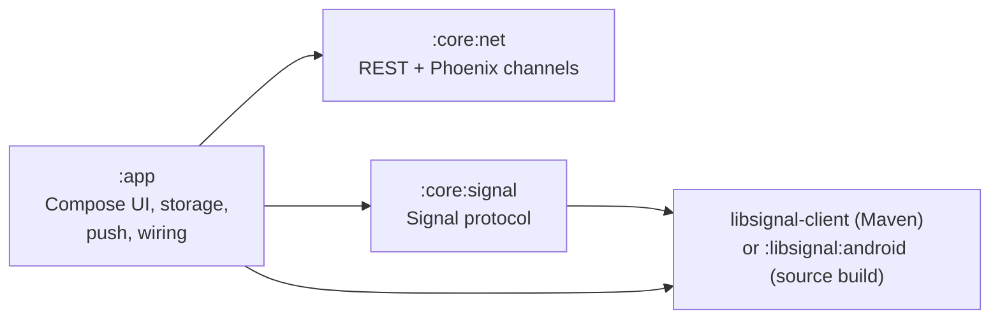
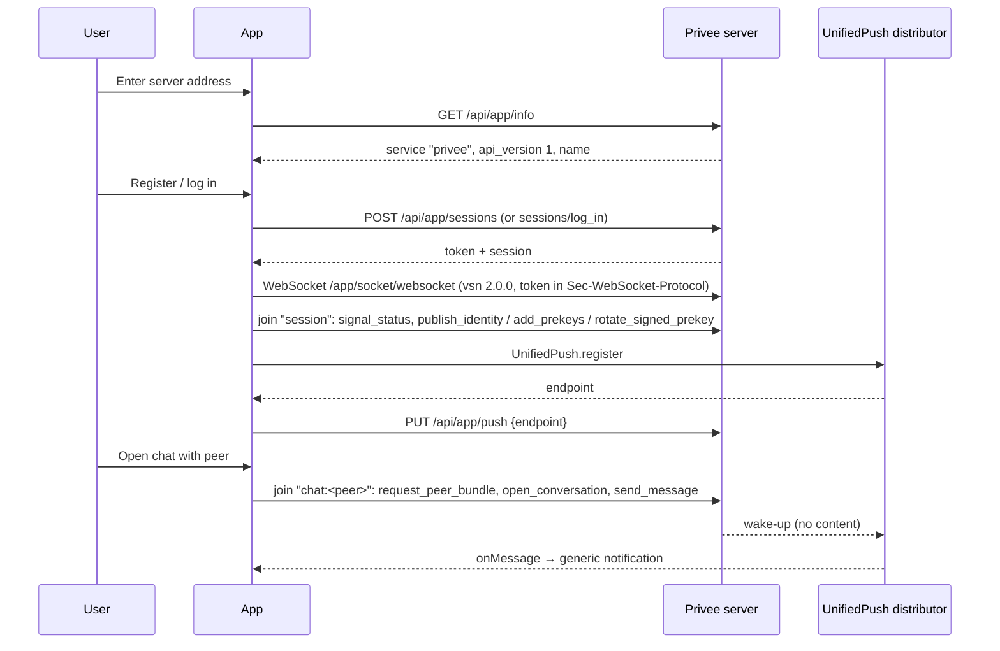

# Architecture

How Privee for Android is put together, where to make common changes, and which
changes affect reproducible builds. For the stack and versions see
[TECHNOLOGIES.md](TECHNOLOGIES.md). For the server side and the shared
app-server contract see Privee's
[`docs/ARCHITECTURE.md`](https://github.com/MaxDac/Privee/blob/main/docs/ARCHITECTURE.md)
and [`docs/cross-repo.md`](https://github.com/MaxDac/Privee/blob/main/docs/cross-repo.md).

## Modules

| Module | Plugin | Contents |
|---|---|---|
| `app` | Android application | `MainActivity` (navigation), `PriveeApplication`, `ui/` screens and ViewModels, `data/` (wiring, storage, sessions, conversations), `push/` (UnifiedPush, notifications) |
| `core/net` | Kotlin JVM | `PriveeApi` (REST client for `/api/app`), `PhoenixSocket` (channels client), `ServerInfo` (server check and URL normalisation), `Http` |
| `core/signal` | Kotlin JVM | `SignalClient` (key publication, sessions, encrypt/decrypt, outbox, history, safety numbers), `PriveeProtocolStore`, `SignalState` |
| `libsignal/android` | Android library | Only with `-PlibsignalBuiltFromSource`: libsignal's Java sources plus the source-built `libsignal_jni.so` |

**Rule:** `core/*` are plain Kotlin/JVM modules. They must not import
`android.*` or `androidx.*` (the PR template checks this). Anything that needs
Android goes in `app`, behind an interface such as `StateStorage`. This keeps
the protocol and network code testable with plain JUnit.

## Runtime wiring

`PriveeApplication` creates one `AppContainer`, a hand-written dependency
container:

- **`ServerStore`**: the selected server (`server.bin`).
- **`ActiveServer`**: the selected server's `PriveeApi`, its per-server directory
  `noBackupFilesDir/servers/<directoryName>/`, and its `AccountStore`.
- **`PriveeSession`**: exists while signed in. It owns:
  - the `PhoenixSocket`;
  - the `session` channel;
  - the `SignalClient`, whose state is stored in `signal-<sessionId>.bin` in the server directory.
- **`ChatConversation`**: one per open chat, using channel `chat:<peerName>`.

Everything stored is encrypted by `EncryptedFileStorage`, using AES-GCM under a non-exportable Android Keystore key. All of it lives under `noBackupFilesDir`, so it is never included in backups.

## Data flow

1. **Choosing a server.** `ServerInfo.fetchServerInfo` calls
   `GET <server>/api/app/info`. It accepts the server only if `service` is
   `privee` and `api_version` is in `SUPPORTED_API_VERSIONS` (currently `{1}`).
   Release builds accept only `https://`.
2. **Authentication.** `PriveeApi` calls these endpoints, under `/api/app/`:

   | Method and path | Purpose |
   |---|---|
   | `POST sessions` | Register |
   | `POST sessions/log_in` | Log in |
   | `GET session` | Fetch the session |
   | `DELETE session` | Log out |
   | `PUT push` | Register the push endpoint |
   | `DELETE push` | Remove the push endpoint |

   Authenticated requests carry the bearer token.
3. **Socket.** `PhoenixSocket` connects to `<server>/app/socket/websocket?vsn=2.0.0`, sending the token as a `Sec-WebSocket-Protocol` entry, as phoenix.js does. It heartbeats, reconnects with backoff, and rejoins channels.
4. **Keys.** These run on the `session` channel. `SignalClient` reconciles keys with `signal_status` and publishes them through:
   - `publish_identity` and `reset_identity`;
   - `add_prekeys`;
   - `rotate_signed_prekey`.

   It reacts to the server events `replenish_prekeys`, `identity_superseded` and `message_received`.
5. **Messages.** These run on the `chat:<peer>` channel:
   - `request_peer_bundle` returns PQXDH bundles;
   - `open_conversation` returns the epoch;
   - `send_message` sends a message, with a client nonce and the epoch.

   The server event `new_message` or `peer_keys_ready` triggers `sync()`. Plaintext history stays on the device.
6. **Notifications:** see [TECHNOLOGIES.md#notifications](TECHNOLOGIES.md#notifications).

The authoritative description of these endpoints and events is the server's
[`docs/client-api.md`](https://github.com/MaxDac/Privee/blob/main/docs/client-api.md).

## Where to change what

| Change | Where | Also update |
|---|---|---|
| New screen or navigation route | `app/.../ui/`, `MainActivity` (`NavHost`) | Strings in `app/src/main/res/values/strings.xml` |
| New REST call | `core/net/PriveeApi.kt` + `PriveeApiTest` | Server first (see [cross-repo](https://github.com/MaxDac/Privee/blob/main/docs/cross-repo.md)) |
| New channel event or call | `PriveeSession` / `ChatConversation` (handlers), `SignalClient` (calls) | Server `client-api.md` |
| Server API version support | `ServerInfo.SUPPORTED_API_VERSIONS` + `ServerInfoTest` | README "Choosing a server" |
| Protocol or key handling | `core/signal` + `SignalClientTest` | Server `e2e-encryption.md` (both clients must agree) |
| Local storage format | `data/*Store.kt`, `SignalState` | Migrate old data (see `AppContainer.migrateLegacyData`) |
| Notifications | `push/Notifications.kt`, `push/PriveePushService.kt` | |
| Dependency versions | `gradle/libs.versions.toml` | Skill `dependency-upgrade` |
| libsignal version | `libs.versions.toml` + `libsignal/source.lock.json` | Skill `libsignal-upgrade`; server WASM version |
| Store listing | `fastlane/metadata/android/en-US/` | Skill `store-screenshots` |
| Release | `version.properties` + `changelogs/<code>.txt` (release-bump PR only) | Skill `fdroid-release` |

## Changes that affect reproducible builds

The Reproducibility workflow runs (and its required checks do real work) when a
PR touches any of:

- `app/**`, `core/**`, `libsignal/**`, `gradle/**`;
- `*.gradle.kts`, `gradle.properties`, `version.properties`;
- `metadata/**`, `scripts/fdroid*`;
- `reproducibility.yml` or `release.yml`.

Pay special attention to:

- **Dependency or plugin upgrades.** They change `classes*.dex` and resources, and may add native libraries. `verify_release_apk.py` allows exactly two `.so` files.
- **Anything that embeds time, paths or randomness** in the APK, such as build timestamps, absolute paths or non-deterministic code generation.
- **The libsignal pins**, the NDK and the Rust toolchain. Changing any of them changes the `.so` hash, which must be re-pinned from a buildserver-image build.
- **The buildserver image digest** in `scripts/fdroid-rb-docker.sh`.

If the Reproducibility check fails, follow
[FDROID_VALIDATION.md](FDROID_VALIDATION.md) (diffoscope triage table).

## Invariants

- Never change the release signing key or certificate. F-Droid publishes our APK only if it is signed with `AllowedAPKSigningKeys` (`ea586e3f…92f9`), and users cannot update across a key change.
- No Google Play Services, Firebase or other proprietary dependencies.
- No plaintext, keys or tokens in logs, notifications, push payloads or backups.
- Per-server isolation: one server's identity, keys or history are never reused on another.
